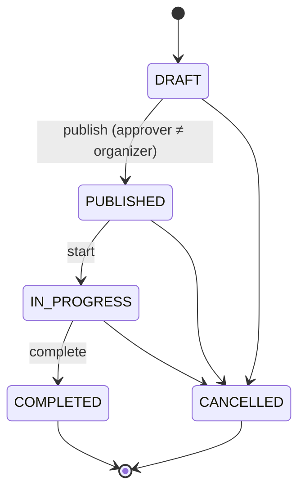
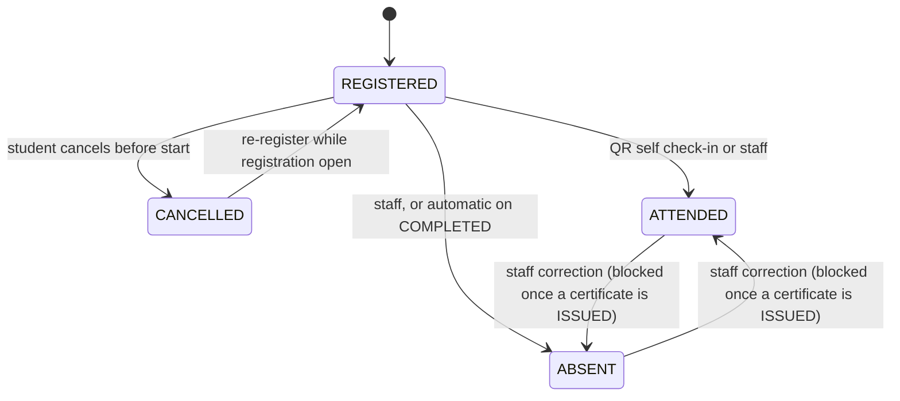

# SVC-RMS — Software Requirements Specification

**System:** Student Volunteerism and Community Service Records Management System (SVC-RMS)
**Client:** Directorate of Community Outreach, Linkages and Partnerships (DCOLAP), Technical University of Kenya (TUK)
**Version:** 1.0 (build baseline) · **Date:** 2026-10-01
**Normative language:** *shall* = mandatory · *should* = recommended · *may* = optional. Requirement IDs are stable; never renumber, only add.

> **Reading guide for humans and coding agents.** Sections 5–7 are the build contract (data model, requirements, API). Section 4 fixes every technology choice so nobody has to re-decide it. Section 9 defines how each requirement is verified. Where something is unknown, Appendix A states the default adopted so work is never blocked. If this document and an agent's judgement disagree, this document wins; raise a PR against it instead of silently deviating.

---

## 1. Introduction

### 1.1 Purpose
This SRS turns the conceptual design in the research project *Designing a Student Volunteerism and Community Service Records Management System for the Technical University of Kenya* (Chapters 4–5) into a buildable, testable specification. It is the single source of truth for scaffolding and implementation.

### 1.2 Scope
**In scope (MVP and follow-on):** student self-registration and login; activity publication and lifecycle; student registration for activities; QR and manual attendance; signed certificates with public verification; records repository with metadata, search and retention locks; aggregate reporting and CSV export; audit trail; role-based access control; backup and restore.

**Out of scope:** integration with a university student information system or SSO; native mobile apps; SMS; payments; AI features; multi-campus tenancy; PDF/A archival conformance; digital preservation migration programmes.

### 1.3 Definitions
| Term | Meaning |
|---|---|
| DCOLAP | Directorate of Community Outreach, Linkages and Partnerships — the system owner |
| Activity | A volunteer or community-service event run by DCOLAP |
| Participation | A student's registration against one activity; the ledger row that carries status and hours |
| Check-in token | Short-lived code shown by the coordinator as a QR; proves presence at the event |
| CVID | Certificate Verification ID, e.g. `TUK-VOL-2026-K7Q2M9XD4P` |
| Service hours | Hours credited per attendee of an activity, fixed by staff when the activity is created |
| Retention lock | Rule blocking disposal of a record before its retention expiry or while under legal hold |
| Approver | A STAFF user with `can_approve = true` |

### 1.4 Relationship to the research project
Stakeholder needs come from the study (Tables 4.16–4.19 and the Assistant Director interview). Where this SRS intentionally refines or departs from the conceptual design, the deviation is listed in Appendix C so that the thesis and the build can be defended consistently.

### 1.5 References
- Research project report, Chapters 3–5 (TUK, 2026).
- ISO/IEC/IEEE 29148:2018 (requirements engineering); ISO 15489-1:2016 (records concepts); ISO 16175-1:2020 and ISO/TS 16175-2:2020 (records software) — used as guidance, not claimed as certified conformance.
- Kenya Data Protection Act, 2019 and Data Protection (General) Regulations, 2021 — primary texts from Kenya Law / ODPC. Section numbers cited in this SRS must be verified against the Act text before submission.
- OWASP ASVS 4.0 (Level 2 used as the security checklist), OWASP API Security Top 10.

---

## 2. Overall description

### 2.1 User classes
| Role (enum) | Thesis term | Who | Key capabilities |
|---|---|---|---|
| `STUDENT` | Students (90.8% support, Table 4.19) | TUK students | Self-register, browse and register for activities, check in, view own history and certificates |
| `STAFF` | Directorate Staff (92.4%) | DCOLAP officers; `can_approve` flag for approvers | Manage activities, attendance, certificates, records, reports |
| `MANAGEMENT` | University Management (74.9%) | Senior leadership | Read aggregate dashboards only; no student-level data |
| `ADMIN` | System Administrator (87.4%) | ICT/system owner | User administration, audit viewer, disposal, configuration |

### 2.2 Operating environment
Linux VM running Docker Compose (reverse proxy, web, API, PostgreSQL). Modern evergreen browsers; Android Chrome and iOS Safari for check-in. Camera access requires HTTPS.

### 2.3 Constraints
- **C-01** Built by one developer using AI coding agents; scope is cut by priority (§2.5), never by dropping tests.
- **C-02** Node.js 24 LTS (Node 22 acceptable). Node 20 reached end of life on 2026-04-30 and shall not be used.
- **C-03** No real student data in the repository, CI, seed or demo environments. All fixtures are synthetic.
- **C-04** All timestamps stored as UTC `timestamptz`; displayed in Africa/Nairobi (EAT).
- **C-05** English-language UI only.

### 2.4 Assumptions and dependencies
See Appendix A (each has a default so the build proceeds without waiting).

### 2.5 Priorities (MoSCoW)
**M** = Must (MVP, blocks demo) · **S** = Should (build if MVP is green) · **C** = Could (only after S).

---

## 3. Evidence baseline (from the study)

| Finding | Value | Source |
|---|---|---|
| Support for a centralised system | 91.9% (351/382 students) | Table 4.16 |
| Most-wanted features | Easy retrieval 91.1%; secure storage 88.0%; online registration 83.5%; certificate generation 81.4%; attendance tracking 79.8%; reports 76.7%; authentication 75.1%; search 73.6%; backup/recovery 72.3%; notifications 64.9% | Table 4.17 |
| Required functions | Store records 90.3%; search/retrieve 89.3%; register students 87.4%; record attendance 85.6%; auto-certificates 82.7%; participation history 81.7%; activity reports 78.8% | Table 4.18 |
| Current storage | Paper in offices 38.0%; computers 28.3%; email 18.8%; cloud 8.1%; unsure 6.8% | Table 4.9 |
| Top challenges | No centralised system 89.3%; retrieval difficulty 85.6%; dispersed storage 82.2%; duplication 74.9%; storage limits 66.5%; risk of loss 64.9%; access delays 62.6% | Table 4.13 |

**Evidence caveats (state these at the defence, do not hide them):** student responses describe *perceived* practice, not audited office practice; the only staff voice is one interview (the Assistant Director); sampling was purposive, with Yamane's formula used to size the sample. These findings justify the *need*; they do not measure system performance.

---

## 4. Architecture and technology decisions

Decisions are final for the build. Versions: use the current stable major at scaffold time, pin exact versions in the lockfile, and do not downgrade without a PR.

| ID | Decision | Rationale |
|---|---|---|
| ADR-01 | **pnpm monorepo**: `apps/api`, `apps/web`, `packages/shared` (zod schemas, types, error codes), `ops/`, `docs/` | One repo for agents; shared contract prevents API/UI drift |
| ADR-02 | **API: NestJS on the Fastify adapter**, TypeScript `strict`, validation with **zod** (`nestjs-zod`), unknown keys rejected | Typed modules, deny-by-default guards; strict validation stops mass assignment |
| ADR-03 | **Web: Next.js (App Router) + Tailwind**. The web app holds no business logic; it calls `/api/v1/*` | Keeps the three-tier design from the thesis (presentation / application / data) |
| ADR-04 | **PostgreSQL 16+** with **Prisma** for CRUD. Triggers, partial indexes, check constraints, generated columns and grants live in **raw SQL migrations**. `$queryRaw` only as tagged templates | Prisma cannot express these natively; raw queries must stay parameterised |
| ADR-05 | **Auth**: local email+password (thesis §5.6.1), **Argon2id**; access JWT (HS256 via `jose`, 15 min); opaque rotating refresh token in an httpOnly, Secure, SameSite=Lax cookie, stored hashed in `sessions` | Stateless access, revocable sessions, inactivity enforced server-side |
| ADR-06 | **Audit**: DB triggers capture row changes; app code writes event rows; actor passed per transaction via `set_config('app.user_id', …, true)` from a Prisma client extension; hash-chained, append-only | Triggers alone record the DB role, not the human |
| ADR-07 | **Certificates**: Ed25519 signature (Node `crypto`) over canonical JSON; PDF with **PDFKit**; QR drawn as vector from the `qrcode` module matrix | pdf-lib has had no release since 2021; signature is verifiable with a published public key, unlike a salted hash |
| ADR-08 | **File storage**: local volume behind a `StorageService` interface (S3-compatible adapter later). Opaque random keys; SHA-256 computed server-side | Fewer moving parts; "encrypted at rest" is a **deployment** control (disk/volume encryption), not application code |
| ADR-09 | **No Redis in MVP.** Rate limiting via `@nestjs/throttler` in-process; the API runs as a single instance. Revisit if scaled out | Removes a service; limitation documented |
| ADR-10 | **No job queue in MVP.** Certificate rows are created synchronously; PDFs are generated lazily on first download and cached | Bulk issue never times out |
| ADR-11 | **Deployment**: Docker Compose on one VM; Caddy terminates TLS (1.2+, 1.3 preferred) and serves web at `/` and API at `/api` on **one origin** | Same-origin cookies, no CORS surface |
| ADR-12 | **Email**: nodemailer over SMTP; Mailpit in development; sending never blocks or fails the main transaction | Notifications are secondary |
| ADR-13 | **Testing**: Jest + Supertest + Testcontainers (API), Vitest + Testing Library (web), Playwright (e2e), k6 (performance), axe-core (accessibility) | See §9 |
| ADR-14 | **Time/IDs**: UUID primary keys (`gen_random_uuid()`); all APIs use ISO-8601 UTC | Unguessable IDs; ownership checks are still mandatory (AUTH-08) |

### 4.1 Repository layout
```
.
├─ AGENTS.md                      # agent rules (see AGENT-PROMPTS.md)
├─ .github/
│  ├─ copilot-instructions.md
│  └─ workflows/{ci.yml,copilot-setup-steps.yml}
├─ docs/{SRS.md,slices.json,adr/,RUNBOOK.md,db/{0001_baseline.sql,smoke.sql}}
├─ packages/shared/               # zod schemas, error codes, role enums
├─ apps/
│  ├─ api/{src/modules/*,prisma/{schema.prisma,migrations/},test/}
│  └─ web/{src/app/*,e2e/}
├─ ops/{docker-compose.yml,docker-compose.prod.yml,Caddyfile,backup.sh,restore.sh}
└─ .env.example
```
API modules: `auth, users, students, activities, participations, attendance, certificates, records, reports, notifications, audit, partners, health`.

### 4.2 Configuration (validated at startup; the app refuses to boot on missing or weak values)
| Variable | Purpose |
|---|---|
| `DATABASE_URL` | Postgres connection (app role, **not** owner) |
| `JWT_ACCESS_SECRET` | ≥ 32 random bytes |
| `REFRESH_TOKEN_PEPPER` | Pepper for hashing refresh and email tokens |
| `QR_MASTER_SECRET` | Derives per-activity check-in keys |
| `CERT_SIGNING_PRIVATE_KEY`, `CERT_SIGNING_KEY_ID` | Ed25519 private key (PEM, base64) and its id |
| `PUBLIC_WEB_ORIGIN` | Used in QR URLs and emails |
| `ALLOWED_STUDENT_EMAIL_DOMAINS` | Comma-separated domains allowed to self-register |
| `SMTP_URL`, `MAIL_FROM` | Outbound mail |
| `STORAGE_ROOT`, `MAX_UPLOAD_BYTES` | File store path; default 10485760 |
| `ISSUER_NAME`, `SIGNATORY_1_NAME/TITLE`, `SIGNATORY_2_NAME/TITLE` | Printed on certificates |
| `NODE_ENV`, `LOG_LEVEL` | Runtime |

---

## 5. Domain model

### 5.1 State machines





Certificates: `ISSUED → REVOKED` (terminal). Reissue creates a new `ISSUED` row whose `supersedes_id` points at the revoked one.

### 5.2 Entities (thesis §5.7 mapped)
`users`, `students`, `schools`, `activity_types`, `community_partners`, `activities`, `participations`, `attendances`, `certificates`, `record_classes`, `documents`, `activity_reports`, `consents`, `notifications`, `sessions`, `email_tokens`, `audit_log`.

### 5.3 Reference SQL (authoritative; Prisma schema must mirror it, raw parts go in SQL migrations)

```sql
-- ===== Types =====
CREATE TYPE user_role AS ENUM ('STUDENT','STAFF','MANAGEMENT','ADMIN');
CREATE TYPE activity_status AS ENUM ('DRAFT','PUBLISHED','IN_PROGRESS','COMPLETED','CANCELLED');
CREATE TYPE participation_status AS ENUM ('REGISTERED','CANCELLED','ATTENDED','ABSENT');
CREATE TYPE attendance_method AS ENUM ('QR_SELF','MANUAL_STAFF');
CREATE TYPE certificate_status AS ENUM ('ISSUED','REVOKED');
CREATE TYPE document_status AS ENUM ('ACTIVE','DISPOSED');

-- ===== Identity =====
CREATE TABLE users (
  id UUID PRIMARY KEY DEFAULT gen_random_uuid(),
  email VARCHAR(255) NOT NULL UNIQUE CHECK (email = lower(email)),
  password_hash TEXT NOT NULL,
  role user_role NOT NULL,
  can_approve BOOLEAN NOT NULL DEFAULT FALSE CHECK (NOT can_approve OR role IN ('STAFF','ADMIN')),
  is_active BOOLEAN NOT NULL DEFAULT TRUE,
  email_verified_at TIMESTAMPTZ,
  must_change_password BOOLEAN NOT NULL DEFAULT FALSE,
  failed_login_count INTEGER NOT NULL DEFAULT 0,
  locked_until TIMESTAMPTZ,
  created_at TIMESTAMPTZ NOT NULL DEFAULT now(),
  updated_at TIMESTAMPTZ NOT NULL DEFAULT now()
);

CREATE TABLE sessions (
  id UUID PRIMARY KEY DEFAULT gen_random_uuid(),
  user_id UUID NOT NULL REFERENCES users(id) ON DELETE CASCADE,
  family_id UUID NOT NULL,                       -- rotation family for reuse detection
  refresh_hash BYTEA NOT NULL UNIQUE,            -- SHA-256(token || pepper)
  created_at TIMESTAMPTZ NOT NULL DEFAULT now(),
  last_used_at TIMESTAMPTZ NOT NULL DEFAULT now(),
  expires_at TIMESTAMPTZ NOT NULL,               -- absolute cap: created_at + 8h
  revoked_at TIMESTAMPTZ,
  ip INET, user_agent TEXT
);
CREATE INDEX ix_sessions_user ON sessions(user_id);

CREATE TABLE email_tokens (
  id UUID PRIMARY KEY DEFAULT gen_random_uuid(),
  user_id UUID NOT NULL REFERENCES users(id) ON DELETE CASCADE,
  purpose TEXT NOT NULL CHECK (purpose IN ('VERIFY_EMAIL','RESET_PASSWORD')),
  token_hash BYTEA NOT NULL UNIQUE,
  expires_at TIMESTAMPTZ NOT NULL,
  used_at TIMESTAMPTZ
);

CREATE TABLE schools (
  id SMALLSERIAL PRIMARY KEY,
  name VARCHAR(255) NOT NULL UNIQUE               -- seed list is a placeholder (Appendix A)
);

CREATE TABLE students (
  id UUID PRIMARY KEY DEFAULT gen_random_uuid(),
  user_id UUID NOT NULL UNIQUE REFERENCES users(id) ON DELETE RESTRICT,
  reg_number VARCHAR(50) NOT NULL UNIQUE CHECK (reg_number = upper(reg_number)),
  full_name VARCHAR(255) NOT NULL,
  gender TEXT NOT NULL DEFAULT 'UNDISCLOSED' CHECK (gender IN ('FEMALE','MALE','OTHER','UNDISCLOSED')),
  school_id SMALLINT NOT NULL REFERENCES schools(id),
  programme VARCHAR(255) NOT NULL,
  year_of_study SMALLINT NOT NULL CHECK (year_of_study BETWEEN 1 AND 6),
  phone VARCHAR(30),                              -- optional (data minimisation)
  created_at TIMESTAMPTZ NOT NULL DEFAULT now(),
  updated_at TIMESTAMPTZ NOT NULL DEFAULT now()
);

CREATE TABLE consents (
  id UUID PRIMARY KEY DEFAULT gen_random_uuid(),
  user_id UUID NOT NULL REFERENCES users(id) ON DELETE RESTRICT,
  notice_version VARCHAR(20) NOT NULL,
  accepted_at TIMESTAMPTZ NOT NULL DEFAULT now(),
  ip INET
);

-- ===== Activities =====
CREATE TABLE activity_types (
  id SMALLSERIAL PRIMARY KEY,
  code VARCHAR(40) NOT NULL UNIQUE,               -- TREE_PLANTING, FUNDRAISING, CLEANUP, DONATION, MENTORSHIP, OTHER
  name VARCHAR(100) NOT NULL
);

CREATE TABLE community_partners (
  id UUID PRIMARY KEY DEFAULT gen_random_uuid(),
  name VARCHAR(255) NOT NULL,
  contact_person VARCHAR(255),
  email VARCHAR(255), phone VARCHAR(50), address TEXT,
  created_at TIMESTAMPTZ NOT NULL DEFAULT now(),
  updated_at TIMESTAMPTZ NOT NULL DEFAULT now()
);

CREATE TABLE activities (
  id UUID PRIMARY KEY DEFAULT gen_random_uuid(),
  title VARCHAR(255) NOT NULL,
  type_id SMALLINT NOT NULL REFERENCES activity_types(id),
  description TEXT NOT NULL,
  venue VARCHAR(255) NOT NULL,
  venue_lat NUMERIC(9,6), venue_lng NUMERIC(9,6), geofence_radius_m INTEGER CHECK (geofence_radius_m > 0),
  start_at TIMESTAMPTZ NOT NULL,
  end_at TIMESTAMPTZ NOT NULL,
  registration_closes_at TIMESTAMPTZ NOT NULL,
  capacity INTEGER NOT NULL CHECK (capacity > 0),
  service_hours NUMERIC(4,1) NOT NULL CHECK (service_hours > 0),
  eligible_years SMALLINT[],                      -- NULL = all years
  status activity_status NOT NULL DEFAULT 'DRAFT',
  partner_id UUID REFERENCES community_partners(id) ON DELETE RESTRICT,
  organizer_id UUID NOT NULL REFERENCES users(id),
  approved_by UUID REFERENCES users(id),
  approved_at TIMESTAMPTZ,
  created_at TIMESTAMPTZ NOT NULL DEFAULT now(),
  updated_at TIMESTAMPTZ NOT NULL DEFAULT now(),
  CHECK (end_at > start_at),
  CHECK (registration_closes_at <= start_at),
  CHECK (approved_by IS NULL OR approved_by <> organizer_id),
  CHECK (status IN ('DRAFT','CANCELLED') OR approved_by IS NOT NULL)
);
CREATE INDEX ix_activities_status_start ON activities(status, start_at);

-- ===== Participation and attendance =====
CREATE TABLE participations (
  id UUID PRIMARY KEY DEFAULT gen_random_uuid(),
  student_id UUID NOT NULL REFERENCES students(id) ON DELETE RESTRICT,
  activity_id UUID NOT NULL REFERENCES activities(id) ON DELETE RESTRICT,
  status participation_status NOT NULL DEFAULT 'REGISTERED',
  registered_at TIMESTAMPTZ NOT NULL DEFAULT now(),
  cancelled_at TIMESTAMPTZ,
  hours_awarded NUMERIC(4,1) NOT NULL DEFAULT 0 CHECK (hours_awarded >= 0),
  hours_override_reason TEXT,
  UNIQUE (student_id, activity_id)
);
CREATE INDEX ix_participations_activity_status ON participations(activity_id, status);

CREATE TABLE attendances (
  id UUID PRIMARY KEY DEFAULT gen_random_uuid(),
  participation_id UUID NOT NULL UNIQUE REFERENCES participations(id) ON DELETE RESTRICT,
  checked_in_at TIMESTAMPTZ NOT NULL DEFAULT now(),
  method attendance_method NOT NULL,
  recorded_by UUID NOT NULL REFERENCES users(id), -- the student's own user for QR_SELF
  lat NUMERIC(9,6), lng NUMERIC(9,6),
  location_flag BOOLEAN NOT NULL DEFAULT FALSE,
  remarks TEXT
);

-- ===== Certificates =====
CREATE TABLE certificates (
  id UUID PRIMARY KEY DEFAULT gen_random_uuid(),
  participation_id UUID NOT NULL REFERENCES participations(id) ON DELETE RESTRICT,
  cvid VARCHAR(40) NOT NULL UNIQUE,
  payload JSONB NOT NULL,                         -- exactly what was signed
  signature BYTEA NOT NULL,                       -- Ed25519 over canonical(payload)
  key_id VARCHAR(32) NOT NULL,
  status certificate_status NOT NULL DEFAULT 'ISSUED',
  issued_at TIMESTAMPTZ NOT NULL DEFAULT now(),
  issued_by UUID NOT NULL REFERENCES users(id),
  revoked_at TIMESTAMPTZ, revoked_by UUID REFERENCES users(id), revocation_reason TEXT,
  supersedes_id UUID REFERENCES certificates(id),
  template_version SMALLINT NOT NULL DEFAULT 1,
  pdf_storage_key TEXT, pdf_sha256 CHAR(64),      -- filled on first download
  CHECK ((status = 'REVOKED') = (revoked_at IS NOT NULL AND revoked_by IS NOT NULL AND revocation_reason IS NOT NULL))
);
CREATE UNIQUE INDEX ux_certificates_one_active ON certificates(participation_id) WHERE status = 'ISSUED';

-- ===== Records repository =====
CREATE TABLE record_classes (
  code VARCHAR(40) PRIMARY KEY,                   -- e.g. ATTENDANCE_REGISTER, APPROVAL_LETTER, PHOTO, FINANCIAL, ACTIVITY_REPORT
  name VARCHAR(150) NOT NULL,
  retention_years SMALLINT NOT NULL CHECK (retention_years > 0)  -- PLACEHOLDER values until DCOLAP confirms (Appendix A)
);

CREATE TABLE documents (
  id UUID PRIMARY KEY DEFAULT gen_random_uuid(),
  activity_id UUID NOT NULL REFERENCES activities(id) ON DELETE RESTRICT,
  class_code VARCHAR(40) NOT NULL REFERENCES record_classes(code),
  title VARCHAR(255) NOT NULL,
  description TEXT,
  file_name VARCHAR(255) NOT NULL,
  mime_type VARCHAR(100) NOT NULL CHECK (mime_type IN ('application/pdf','image/png','image/jpeg')),
  size_bytes BIGINT NOT NULL CHECK (size_bytes > 0),
  sha256 CHAR(64) NOT NULL,
  storage_key TEXT NOT NULL UNIQUE,
  captured_at TIMESTAMPTZ NOT NULL DEFAULT now(),
  captured_by UUID NOT NULL REFERENCES users(id),
  retention_expires_at TIMESTAMPTZ NOT NULL,
  legal_hold BOOLEAN NOT NULL DEFAULT FALSE,
  status document_status NOT NULL DEFAULT 'ACTIVE',
  disposed_at TIMESTAMPTZ, disposed_by UUID REFERENCES users(id), disposal_reason TEXT,
  search_tsv TSVECTOR GENERATED ALWAYS AS
    (to_tsvector('simple', coalesce(title,'') || ' ' || coalesce(description,'') || ' ' || coalesce(file_name,''))) STORED
);
CREATE INDEX ix_documents_search ON documents USING GIN (search_tsv);
CREATE INDEX ix_documents_activity ON documents(activity_id);

CREATE TABLE activity_reports (
  id UUID PRIMARY KEY DEFAULT gen_random_uuid(),
  activity_id UUID NOT NULL REFERENCES activities(id) ON DELETE RESTRICT,
  title VARCHAR(255) NOT NULL,
  body TEXT NOT NULL,
  created_by UUID NOT NULL REFERENCES users(id),
  created_at TIMESTAMPTZ NOT NULL DEFAULT now()
);

CREATE TABLE notifications (
  id UUID PRIMARY KEY DEFAULT gen_random_uuid(),
  user_id UUID NOT NULL REFERENCES users(id) ON DELETE CASCADE,
  type VARCHAR(50) NOT NULL, title VARCHAR(255) NOT NULL, body TEXT, link TEXT,
  read_at TIMESTAMPTZ,
  created_at TIMESTAMPTZ NOT NULL DEFAULT now()
);
CREATE INDEX ix_notifications_user_unread ON notifications(user_id, created_at DESC) WHERE read_at IS NULL;

-- ===== Audit (append-only, hash-chained) =====
CREATE TABLE audit_log (
  id BIGSERIAL PRIMARY KEY,
  occurred_at TIMESTAMPTZ NOT NULL DEFAULT clock_timestamp(),
  source TEXT NOT NULL CHECK (source IN ('DB','APP')),
  event_type TEXT NOT NULL,                       -- e.g. participations.UPDATE, auth.LOGIN_FAILED
  table_name TEXT, record_id TEXT, operation TEXT,
  old_data JSONB, new_data JSONB,
  actor_user_id UUID, actor_ip INET, request_id TEXT,
  prev_hash BYTEA, row_hash BYTEA
);
CREATE INDEX ix_audit_actor_time ON audit_log(actor_user_id, occurred_at DESC);
CREATE INDEX ix_audit_table_record ON audit_log(table_name, record_id);

CREATE FUNCTION audit_chain() RETURNS trigger AS $$
DECLARE prev BYTEA;
BEGIN
  PERFORM pg_advisory_xact_lock(7001);            -- serialise chain writes
  SELECT row_hash INTO prev FROM audit_log ORDER BY id DESC LIMIT 1;
  NEW.prev_hash := prev;
  NEW.row_hash := sha256(convert_to(
    coalesce(encode(prev,'hex'),'') || NEW.occurred_at::text || NEW.source || NEW.event_type ||
    coalesce(NEW.table_name,'') || coalesce(NEW.record_id,'') || coalesce(NEW.operation,'') ||
    coalesce(NEW.old_data::text,'') || coalesce(NEW.new_data::text,'') ||
    coalesce(NEW.actor_user_id::text,''), 'UTF8'));
  RETURN NEW;
END $$ LANGUAGE plpgsql;
CREATE TRIGGER trg_audit_chain BEFORE INSERT ON audit_log FOR EACH ROW EXECUTE FUNCTION audit_chain();

CREATE FUNCTION audit_immutable() RETURNS trigger AS $$
BEGIN RAISE EXCEPTION 'audit_log is append-only'; END $$ LANGUAGE plpgsql;
CREATE TRIGGER trg_audit_no_mutation BEFORE UPDATE OR DELETE ON audit_log FOR EACH ROW EXECUTE FUNCTION audit_immutable();
CREATE TRIGGER trg_audit_no_truncate BEFORE TRUNCATE ON audit_log FOR EACH STATEMENT EXECUTE FUNCTION audit_immutable();

CREATE FUNCTION audit_row_change() RETURNS trigger AS $$
DECLARE o JSONB; n JSONB; rid TEXT;
BEGIN
  IF TG_OP IN ('UPDATE','DELETE') THEN o := to_jsonb(OLD) - 'password_hash' - 'refresh_hash' - 'token_hash'; END IF;
  IF TG_OP IN ('INSERT','UPDATE') THEN n := to_jsonb(NEW) - 'password_hash' - 'refresh_hash' - 'token_hash'; END IF;
  rid := COALESCE(n->>'id', o->>'id');
  INSERT INTO audit_log(source,event_type,table_name,record_id,operation,old_data,new_data,actor_user_id,actor_ip,request_id)
  VALUES ('DB', TG_TABLE_NAME || '.' || TG_OP, TG_TABLE_NAME, rid, TG_OP, o, n,
          NULLIF(current_setting('app.user_id', true), '')::uuid,
          NULLIF(current_setting('app.client_ip', true), '')::inet,
          NULLIF(current_setting('app.request_id', true), ''));
  RETURN COALESCE(NEW, OLD);
END $$ LANGUAGE plpgsql;

DO $$ DECLARE t TEXT; BEGIN
  FOREACH t IN ARRAY ARRAY['users','students','activities','participations','attendances','certificates',
                           'documents','community_partners','activity_reports'] LOOP
    EXECUTE format('CREATE TRIGGER trg_audit_%I AFTER INSERT OR UPDATE OR DELETE ON %I
                    FOR EACH ROW EXECUTE FUNCTION audit_row_change()', t, t);
  END LOOP;
END $$;

-- ===== Edit-lock once a certificate is ISSUED =====
CREATE FUNCTION block_edit_after_certificate() RETURNS trigger AS $$
DECLARE pid UUID;
BEGIN
  IF TG_TABLE_NAME = 'participations' THEN
    pid := OLD.id;
    IF TG_OP = 'UPDATE' THEN
      IF NEW.status = OLD.status AND NEW.hours_awarded = OLD.hours_awarded THEN
        RETURN NEW;                               -- unrelated column change
      END IF;
    END IF;
  ELSE
    pid := OLD.participation_id;
  END IF;
  IF EXISTS (SELECT 1 FROM certificates WHERE participation_id = pid AND status = 'ISSUED') THEN
    RAISE EXCEPTION 'CERTIFICATE_LOCKED' USING ERRCODE = 'P0001';
  END IF;
  RETURN COALESCE(NEW, OLD);
END $$ LANGUAGE plpgsql;
CREATE TRIGGER trg_lock_participations BEFORE UPDATE OR DELETE ON participations FOR EACH ROW EXECUTE FUNCTION block_edit_after_certificate();
CREATE TRIGGER trg_lock_attendances   BEFORE UPDATE OR DELETE ON attendances   FOR EACH ROW EXECUTE FUNCTION block_edit_after_certificate();

-- ===== Grants (app connects as svc_app, never as owner) =====
-- REVOKE ALL ON ALL TABLES IN SCHEMA public FROM svc_app;
-- GRANT SELECT, INSERT, UPDATE, DELETE ON <all tables except audit_log> TO svc_app;
-- GRANT SELECT, INSERT ON audit_log TO svc_app;  GRANT USAGE ON SEQUENCE audit_log_id_seq TO svc_app;
```

**Validation status:** this SQL was executed on PostgreSQL 16 and exercised for: constraint rejections (self-approval, unapproved publish, revoke without reason, second active certificate), actor attribution, secret redaction, hash-chain recomputation, append-only enforcement for owner and `svc_app`, the certificate edit-lock, and full-text search. The same files ship as `docs/db/0001_baseline.sql` and `docs/db/smoke.sql`; port the smoke script into the integration tests rather than trusting it once.

**Notes the implementer must respect**
- Re-registering after cancellation re-activates the existing `participations` row (the unique key forbids a second row).
- `hours_awarded` is set to `activities.service_hours` when a participation becomes `ATTENDED`, unless staff override with a reason (ATT-03); it is `0` otherwise.
- The owner/superuser role can bypass triggers and grants. Document this in the runbook; chain verification (AUD-04) is what detects such tampering.
- Prisma note: the generated `tsvector` column, partial unique index and all triggers exist only in raw SQL migrations; document queries against `search_tsv` use `$queryRaw`.

### 5.4 Role and ownership matrix
`R`=read · `C`=create · `U`=update · `own`=only rows belonging to the caller (other callers' rows return **404**, never 403) · `—`=no access.

| Resource | STUDENT | STAFF | MANAGEMENT | ADMIN |
|---|---|---|---|---|
| Own profile | R U (limited) | — | — | — |
| Student directory | — | R | — | R |
| Users / roles | — | — | — | C R U (deactivate) |
| Activities (published) | R | C R U (organizer or any staff) | R | R U |
| Participations | C R U `own` (register/cancel) | R U (roster, manual add/remove) | aggregate only | R |
| Attendance | C `own` (QR) | C R U | aggregate only | R U |
| Certificates | R `own` | C R, revoke if `can_approve` | aggregate only | C R, revoke |
| Documents (records) | — | C R, no hard delete | — | R, dispose after expiry |
| Activity reports | — | C R U | R | R |
| Dashboards / exports | — | R | R (aggregate) | R |
| Audit log | — | — | — | R |
| Public verify | anonymous | anonymous | anonymous | anonymous |

---

## 6. Functional requirements

**Conventions.** Each requirement is singular and testable. *AC* uses Given/When/Then. Every requirement ID is the name of at least one automated test (`describe('REQ-ACT-02', …)`), see §9. Priority: M/S/C (§2.5). *Src* points to the study or to a QA rule.

### 6.1 AUTH — Authentication, sessions, access control

| ID | Requirement | Acceptance criteria | Pri | Src |
|---|---|---|---|---|
| AUTH-01 | The system shall let a student self-register with email, password, registration number, full name, school, programme, year of study and an accepted privacy notice. | Given an email in `ALLOWED_STUDENT_EMAIL_DOMAINS` and unused email and reg number, When registering, Then 201 and the account cannot log in until verified. Duplicate email or reg number → 409; disallowed domain → 422; missing consent → 422. | M | T4.17, §5.9.1 |
| AUTH-02 | The system shall verify email ownership using a single-use token valid for 24 hours. | Given a valid token, When submitted, Then `email_verified_at` is set and the token cannot be reused (second use → 410). Expired → 410. | M | QA |
| AUTH-03 | The system shall authenticate users by email and password hashed with Argon2id and return a 15-minute access token and an httpOnly refresh cookie. | Given valid credentials and a verified, active account, When logging in, Then 200 with token and `Set-Cookie` (HttpOnly; Secure; SameSite=Lax). Unknown email and wrong password return the identical 401 body and similar timing. | M | §5.6.1 |
| AUTH-04 | The system shall rotate refresh tokens on every use, reject refresh after 15 minutes of inactivity or 8 hours absolute age, and revoke the session on logout. | Given a session idle for 16 min, When refreshing, Then 401. Given a reused (already rotated) refresh token, Then the whole token family is revoked and an audit event is written. | M | QA |
| AUTH-05 | The system shall throttle credential attacks: 5 consecutive failures per account within 15 minutes lock the account for 15 minutes; 30 login attempts per IP per 10 minutes return 429. | Given 5 failures, When a 6th attempt (even correct) is made, Then 429 with `Retry-After`. Lockout and throttling write audit events. A campus NAT IP cannot lock *other* accounts (account counter is per account). | M | QA |
| AUTH-06 | The system shall support password change and email-based reset (single-use token, 1 hour), enforce a minimum length of 12 characters, and revoke all sessions on reset. | Given a reset token, When a valid new password is set, Then all sessions are revoked and the token is spent. Passwords under 12 characters → 422. | M | QA |
| AUTH-07 | The system shall deny every request by default and permit it only if the endpoint declares the caller's role. Unauthenticated → 401; authenticated but wrong role → 403. | Given an endpoint without a role declaration, Then CI fails (a test enumerates all routes and asserts each has a guard or an explicit `@Public()`). | M | §5.12.2 |
| AUTH-08 | The system shall enforce object-level ownership: a student can read or change only their own participations, attendance, certificates and profile; other students' objects return 404. | Given Student A and Student B's certificate id, When A requests it, Then 404. The IDOR test matrix (§9.3) passes for every `:id` route. | M | OWASP API1 |
| AUTH-09 | The system shall let ADMIN create STAFF, MANAGEMENT and ADMIN accounts (forced password change on first login), deactivate users, and set `can_approve`. ADMIN shall not deactivate or demote themselves if they are the last active ADMIN. | Given the last active ADMIN, When deactivating self, Then 409. | M | §5.4.3 |
| AUTH-10 | The system shall check `is_active` on every authenticated request so a deactivated user loses access immediately. | Given a valid access token for a user deactivated 1 second ago, When calling any endpoint, Then 401. | M | QA |

### 6.2 STU — Student profile and history

| ID | Requirement | Acceptance criteria | Pri | Src |
|---|---|---|---|---|
| STU-01 | A student shall view and update their own phone, programme, year of study and school; registration number and email are read-only. | Given a PATCH including `regNumber`, Then 422 (unknown key rejected). | M | §5.11.2 |
| STU-02 | STAFF and ADMIN shall search students by registration number, name fragment or school, paginated. MANAGEMENT shall not access this endpoint. | Given MANAGEMENT calls the endpoint, Then 403. | M | T4.19 |
| STU-03 | A student shall list their own participation history (activity, date, status, hours, certificate link). | Given 3 participations, Then the list returns exactly those 3 with correct hours and statuses. | M | T4.18 (81.7%) |
| STU-04 | The dashboard shall show a student's cumulative verified hours (sum of `hours_awarded` over `ATTENDED`). | Given hours 8.0 and 4.5, Then 12.5. | S | §5.11.2 |

### 6.3 ACT — Activities and partners

| ID | Requirement | Acceptance criteria | Pri | Src |
|---|---|---|---|---|
| ACT-01 | STAFF shall create a `DRAFT` activity with title, type, description, venue, start and end, registration deadline, capacity ≥ 1, service hours > 0, and optionally partner, eligible years, venue coordinates and geofence radius. | Given `end_at <= start_at` or `registration_closes_at > start_at`, Then 422 with field errors. | M | §5.9.2 |
| ACT-02 | The system shall restrict edits by status: `DRAFT` fully editable; `PUBLISHED` may change description, venue and times but not reduce capacity below the current registered count; `IN_PROGRESS` description only; terminal states none. | Given 30 registered and a capacity change to 20, Then 409. | M | QA |
| ACT-03 | The system shall allow only the transitions in §5.1; any other transition returns 409 `INVALID_STATE_TRANSITION`. Each transition is audited. Cancelling notifies registered students. | Given `COMPLETED → CANCELLED`, Then 409. Given `PUBLISHED → CANCELLED`, Then all REGISTERED participations are notified. | M | QA |
| ACT-04 | Publishing shall require an approver (`can_approve = true`) who is not the organizer; the system records `approved_by` and `approved_at`. | Given the organizer tries to publish their own activity, Then 403. Given a non-approver, Then 403. | M | Segregation of duties |
| ACT-05 | Students shall list `PUBLISHED` and `IN_PROGRESS` activities with filters (type, date range, text) and see seats remaining; drafts and cancelled activities are not visible to students. | Given a draft activity, When a student lists, Then it is absent and `GET /activities/:id` → 404. | M | T4.17 |
| ACT-06 | STAFF shall create, update and list community partners; a partner referenced by an activity cannot be deleted. | Given a referenced partner, When deleting, Then 409. | S | §5.7.8 |
| ACT-07 | STAFF shall view an activity roster (student, status, attendance method and time, hours). | Roster count equals the number of non-cancelled participations. | M | §5.11.3 |
| ACT-08 | The system shall let STAFF mark an activity `IN_PROGRESS` and `COMPLETED` manually. A scheduled auto-start at `start_at` may be added later. | Manual transitions work; no scheduler is required for MVP. | M | QA |

### 6.4 REG — Registration for activities

| ID | Requirement | Acceptance criteria | Pri | Src |
|---|---|---|---|---|
| REG-01 | A student shall register for a `PUBLISHED` activity before `registration_closes_at`, subject to `eligible_years`. | Given a closed deadline → 409 `REGISTRATION_CLOSED`. Given ineligible year → 403 `NOT_ELIGIBLE`. | M | T4.18 (87.4%) |
| REG-02 | The system shall never exceed capacity under concurrent requests (row lock on the activity inside the transaction; count of `REGISTERED` + `ATTENDED`). | Given capacity 50 and 200 simultaneous registrations by distinct students, Then exactly 50 succeed, 150 receive 409 `CAPACITY_FULL`, and the DB count is 50. | M | QA (race) |
| REG-03 | The system shall reject duplicate registration (409 `ALREADY_REGISTERED`) and registration overlapping another `REGISTERED` or `ATTENDED` participation of the same student (409 `SCHEDULE_CONFLICT`; intervals are `[start_at, end_at)`). A per-student advisory lock prevents concurrent double-booking. | Given two overlapping activities registered in parallel by one student, Then exactly one succeeds. | M | QA |
| REG-04 | A student shall cancel their registration until `start_at`; the seat is freed immediately; re-registration re-activates the row while registration is open. | Cancel then re-register → 200, still one row. | M | QA |
| REG-05 | STAFF shall add or remove a student manually (walk-in) with a mandatory reason; capacity still applies. | Missing reason → 422; capacity full → 409. | S | QA |

### 6.5 ATT — Attendance

| ID | Requirement | Acceptance criteria | Pri | Src |
|---|---|---|---|---|
| ATT-01 | The activity organizer or ADMIN shall obtain a rolling check-in token for an `IN_PROGRESS` activity. Algorithm: `K_a = HMAC-SHA256(QR_MASTER_SECRET, "checkin:"+activityId)`; `window = floor(unixMs/30000)`; `token = base32(HMAC-SHA256(K_a, window))[0..9]`. The response includes `token` and `validUntil`. | Given a non-organizer STAFF → 403 (ADMIN allowed). Given a status other than `IN_PROGRESS` → 409. | M | T4.17 (79.8%) |
| ATT-02 | A student shall self check-in by submitting the token. The system accepts the current and the previous window (≤ 60 s), requires a `REGISTERED` participation and the interval `[start_at, end_at + 30 min]`, sets status `ATTENDED`, records the attendance row and sets `hours_awarded = service_hours`. Compare tokens in constant time. Repeat submissions are idempotent (200, no duplicate). | Given a token from 2 windows ago → 422 `TOKEN_INVALID`. Given unregistered student → 403. Given a replay → 200 and the same row. | M | §5.9.3 |
| ATT-03 | STAFF shall record attendance in bulk (`ATTENDED` or `ABSENT`, remarks). An hours override requires a reason and `0 ≤ hours ≤ service_hours`. Edits are blocked (409 `CERTIFICATE_LOCKED`) once an `ISSUED` certificate exists for that participation. | Given an override without reason → 422. Given an issued certificate → 409. | M | §5.4.2 |
| ATT-04 | When an activity becomes `COMPLETED`, remaining `REGISTERED` participations shall become `ABSENT` with 0 hours. | Given 5 REGISTERED at completion, Then 5 ABSENT. | M | QA |
| ATT-05 | If the activity has venue coordinates and the student supplies a location, a position outside `geofence_radius_m` sets `location_flag = true` without blocking the check-in; flagged rows are highlighted in the roster. | Given a point 5 km away → check-in succeeds with the flag set. | S | QA |
| ATT-06 | The student check-in page shall offer manual entry of the 10-character code when the camera is unavailable. | E2E: submit code through the text field → ATTENDED. | M | QA (field reality) |

*Accepted residual risk R-02 (Appendix B): a student can relay a live QR to an absent friend within the 60-second window. Mitigations: staff roster review, geofence flag, and manual-roster mode.*

### 6.6 CRT — Certificates and public verification

| ID | Requirement | Acceptance criteria | Pri | Src |
|---|---|---|---|---|
| CRT-01 | STAFF or ADMIN shall issue certificates for a `COMPLETED` activity to all or selected `ATTENDED` participations with `hours_awarded > 0` that lack an `ISSUED` certificate. The operation is idempotent. | Given 40 eligible, When issuing twice, Then 40 certificates exist, second call creates 0. Given a non-completed activity → 409. | M | T4.18 (82.7%) |
| CRT-02 | The system shall generate each CVID as `TUK-VOL-{YYYY}-{10 chars Crockford base32 from a CSPRNG}` and retry on collision. | CVIDs match `^TUK-VOL-\d{4}-[0-9A-HJKMNP-TV-Z]{10}$`; 10 000 generated are unique. | M | QA |
| CRT-03 | The system shall sign the canonical JSON (keys sorted, no whitespace, UTF-8) of `{v, cvid, studentName, regNumber, activityId, activityTitle, serviceDate, hours, issuedAt, issuer}` with Ed25519 and store payload, signature and `key_id`. The public key shall be published at `GET /api/v1/public/keys`. | Given a stored payload altered by one character, Then verification reports `INVALID_SIGNATURE`. | M | ISO 15489 authenticity |
| CRT-04 | The system shall render a landscape A4 vector PDF (PDFKit) containing issuer, student name, activity, service date, hours, CVID, signatory names and a vector QR code encoding `${PUBLIC_WEB_ORIGIN}/verify/{cvid}`. The PDF is generated on first download, cached, its SHA-256 stored, and size ≤ 150 KB. | Given a downloaded PDF, Then text extraction contains the CVID and a QR decoder reads the correct URL. | M | §5.10.3 |
| CRT-05 | Downloading a cached PDF shall verify its stored SHA-256; a mismatch returns 500 `INTEGRITY_FAILURE` and writes an audit alert. | Given a tampered cached file, Then 500 and an audit row. | M | ISO 15489 integrity |
| CRT-06 | A student shall list and download only their own certificates; STAFF and ADMIN may download any. | Cross-student download → 404 (AUTH-08). | M | §5.4.1 |
| CRT-07 | `GET /api/v1/public/verify/:cvid` shall be unauthenticated, verify the signature and status, and return only: status (`VALID` or `REVOKED`), student name, activity title, service date, hours, issuer, issue date, and revocation date if revoked. It shall not return registration number, school, email or phone. Unknown CVID → 404. Responses carry `Cache-Control: no-store`. | Given a valid CVID → `VALID`. Given a revoked one → `REVOKED`. Response keys exactly match the contract in §7.3. | M | QA (data minimisation) |
| CRT-08 | The public endpoint shall be rate limited to 30 requests per minute per IP; excess returns 429. | 31st request in a minute → 429. | M | QA |
| CRT-09 | STAFF with `can_approve` or ADMIN shall revoke a certificate with a mandatory reason; revoked certificates verify as `REVOKED`. Reissue creates a new certificate with `supersedes_id`. | Given a revoked certificate, Then attendance edits for that participation become possible again. | M | QA |

### 6.7 REC — Records repository

| ID | Requirement | Acceptance criteria | Pri | Src |
|---|---|---|---|---|
| REC-01 | STAFF or ADMIN shall upload a PDF, PNG or JPEG ≤ 10 MB to an activity. The system validates the content signature (magic bytes), not just the declared MIME type, stores the file under a random key, and computes SHA-256 server-side. | Given an `.exe` renamed `.pdf` → 415. Given 10 MB + 1 → 413. Given a path-traversal filename → stored safely, original name kept as metadata only. | M | T4.18 (90.3%) |
| REC-02 | Every record shall carry mandatory metadata: class code, title, creator, capture time, size, MIME, SHA-256, activity, and `retention_expires_at = captured_at + retention_years`. Only title and description are editable afterwards, and edits are audited. | Given a PATCH of `sha256`, Then 422. | M | ISO 16175 |
| REC-03 | The system shall search records by text (`search_tsv`) and filters: activity, class, activity type, capture date range, MIME type; paginated (default 20, max 100). | Given 5 000 seeded documents, Then P95 meets NFR-PERF-01. | M | T4.17 (73.6%, 91.1%) |
| REC-04 | Downloading a record shall verify its SHA-256; mismatch returns 500 `INTEGRITY_FAILURE` and an audit alert. | As CRT-05 for documents. | M | ISO 15489 |
| REC-05 | The system shall block disposal while `now < retention_expires_at` or `legal_hold = true` (409 `RETENTION_ACTIVE`, audited). No endpoint hard-deletes a record. After expiry, only ADMIN may dispose with a reason: the file is removed and the metadata row stays with `status = DISPOSED`. | Given an unexpired record, When ADMIN disposes, Then 409. Given an expired record, Then file gone, row retained. | M | ISO 16175 |
| REC-06 | STAFF shall write a narrative report for an activity (title, body); STAFF, MANAGEMENT and ADMIN can read it. | CRUD works with role checks. | S | §5.7.7 |
| REC-07 | Uploaded files should be scanned (ClamAV) before being made available. | EICAR test file is rejected. | C | OWASP |
| REC-08 | A student's participation statement should be downloadable as a PDF. | PDF lists own verified participations and total hours. | C | §5.10.1 |

### 6.8 RPT — Reports and analytics

| ID | Requirement | Acceptance criteria | Pri | Src |
|---|---|---|---|---|
| RPT-01 | MANAGEMENT, STAFF and ADMIN shall view dashboard aggregates for a date range: activities, participants, attended count, total hours; broken down by month, school, year of study and activity type. No student-level data. | Given seeded data, aggregates equal independent SQL totals in the test. | M | §5.11.4 |
| RPT-02 | The system shall provide an activity report per §5.10.2 (name, type, dates, venue, status, registered, attended, hours, organizer) with filters, and a CSV export. | CSV row count equals filtered count. | M | T4.18 (78.8%) |
| RPT-03 | STAFF shall export a per-student participation report (CSV). | Given a student, Then rows match STU-03. | S | §5.10.1 |
| RPT-04 | All CSV exports shall neutralise spreadsheet formulas (cells beginning `=`, `+`, `-`, `@`, tab or CR are prefixed with `'`) and stream rows rather than buffering. | Given a title `=HYPERLINK(...)`, Then the exported cell starts with `'`. | M | OWASP CSV injection |
| RPT-05 | Exports and report generation shall be written to the audit log with actor and filters. | Audit row exists per export. | M | §5.12.4 |
| RPT-06 | Reports should be exportable as PDF. | — | C | §5.10 |

### 6.9 NTF — Notifications

| ID | Requirement | Acceptance criteria | Pri | Src |
|---|---|---|---|---|
| NTF-01 | The system shall create in-app notifications for registration confirmation, activity cancellation or reschedule, and certificate issued or revoked; users list and mark them read. | Cancelling an activity creates one notification per registered student. | S | T4.17 (64.9%) |
| NTF-02 | The system should also email these events; delivery failure is logged and never fails the originating request. | SMTP down → request still 2xx, failure logged. | C | ADR-12 |

### 6.10 AUD — Audit and traceability

| ID | Requirement | Acceptance criteria | Pri | Src |
|---|---|---|---|---|
| AUD-01 | Row changes (INSERT, UPDATE, DELETE) on the tables listed in §5.3 shall be captured by triggers with secrets redacted (`password_hash`, `refresh_hash`, `token_hash`). | An update to `users` never stores a hash in `old_data` or `new_data`. | M | §5.12.4 |
| AUD-02 | Each request shall set `app.user_id`, `app.client_ip` and `app.request_id` for its database transaction via the Prisma client extension, so audit rows identify the human actor. | Given STAFF X updates an activity, Then the audit row's `actor_user_id` = X and `actor_ip` is set. | M | QA (attribution) |
| AUD-03 | The application shall write event rows for: login success and failure, lockout, refresh reuse, logout, password change/reset, staff certificate downloads, exports, retention-blocked disposal, failed check-ins, integrity failures. | One test per event type. | M | §5.12.4 |
| AUD-04 | `audit_log` shall be append-only (triggers reject UPDATE, DELETE, TRUNCATE; the app role has only SELECT and INSERT) and hash-chained. A command `pnpm audit:verify` shall recompute the chain and exit non-zero if broken. | Given a row modified as owner, Then `audit:verify` fails and names the row id. | M | ISO 16175 |
| AUD-05 | ADMIN shall view and filter the audit log by actor, table, record id, event type and date range, paginated; exports are themselves audited. | MANAGEMENT/STAFF → 403. | M | §5.4.3 |
| AUD-06 | Audit rows shall not be deleted in the MVP. | — | M | QA |

### 6.11 PRIV — Privacy

| ID | Requirement | Acceptance criteria | Pri | Src |
|---|---|---|---|---|
| PRIV-01 | Registration shall store the accepted notice version and time in `consents`. | Registration without consent → 422. | M | DPA 2019 |
| PRIV-02 | The system shall collect only the fields in §5.3; gender and phone are optional. | Registration succeeds without them. | M | DPA 2019 |
| PRIV-03 | ADMIN shall be able to export all data held about one student as JSON and correct profile errors on request. | Export contains profile, participations, attendance, certificates metadata, consents. | S | DPA 2019 |
| PRIV-04 | The system should support anonymising a departed student's profile fields while preserving aggregate and certificate evidence under the documented retention basis. | Name/email/phone replaced by tokens; certificates still verify. | C | DPA 2019 |
| PRIV-05 | Logs shall never contain passwords, tokens, cookies or full request bodies; PII fields are redacted by the logger configuration. | A test greps captured logs for the seeded password and token. | M | OWASP ASVS 7 |

### 6.12 OPS and UI

| ID | Requirement | Acceptance criteria | Pri | Src |
|---|---|---|---|---|
| OPS-01 | The API shall expose `GET /healthz` (liveness) and `GET /readyz` (DB reachable, migrations applied). | `/readyz` is 503 with DB stopped. | M | QA |
| OPS-02 | `ops/backup.sh` shall create a nightly `pg_dump` plus a checksummed archive of the file store; `ops/restore.sh` shall restore both into a clean environment; the runbook documents a restore drill. | CI job restores a dump and runs a row-count and `audit:verify` check. | S | T4.17 (72.3%) |
| OPS-03 | Configuration shall be validated at startup; missing or weak secrets abort boot. | Boot with a 10-byte `JWT_ACCESS_SECRET` fails. | M | QA |
| OPS-04 | Logs shall be structured JSON with request id, route, status, latency. | Sample log line parses and contains those keys. | M | QA |
| UI-01 | Navigation and routes shall reflect role: **Student** `/login /register /activities /activities/[id] /my/history /my/certificates /check-in`; **Staff** `/staff/activities /staff/activities/[id]/{roster,attendance} /staff/certificates /staff/records /staff/reports`; **Management** `/management/dashboard`; **Admin** `/admin/users /admin/audit`; **Public** `/verify/[cvid]`. | A user never sees nav items for other roles; direct URL access is blocked by API 403 regardless. | M | Ch. 5 |
| UI-02 | All student pages and the check-in flow shall work at 360 px width without horizontal scrolling. | Playwright at 360×800 passes. | M | QA |
| UI-03 | Student flows shall have 0 serious or critical axe-core violations and be fully keyboard operable. | CI axe run on login, register, activities, my/history, check-in. | S | WCAG 2.1 AA |
| UI-04 | The coordinator attendance console shall show the QR (refreshing every 25 s), a live checked-in count and the manual roster with bulk actions. | E2E: scan updates the count within 5 s of polling. | M | §5.11.3 |
| UI-05 | All times shall be shown in EAT; every list shall have loading, empty and error states. | Visual/e2e assertions. | M | C-04 |

---

## 7. External interfaces

### 7.1 Conventions
Base path `/api/v1`; JSON; ISO-8601 UTC timestamps; UUID ids. Errors use RFC 9457 `application/problem+json` with a stable `code`. Lists return `{items, page, pageSize, total}` (`pageSize` ≤ 100). Every response carries `X-Request-Id`. Default rate limit 300 requests/min per authenticated user. OpenAPI is generated from the zod schemas and served at `/api/docs` outside production. Unknown request keys are rejected (422).

**Error codes** (`packages/shared`): `VALIDATION_ERROR` 422 · `UNAUTHENTICATED` 401 · `FORBIDDEN` 403 · `NOT_FOUND` 404 · `ALREADY_REGISTERED` 409 · `SCHEDULE_CONFLICT` 409 · `CAPACITY_FULL` 409 · `REGISTRATION_CLOSED` 409 · `NOT_ELIGIBLE` 403 · `INVALID_STATE_TRANSITION` 409 · `RETENTION_ACTIVE` 409 · `CERTIFICATE_LOCKED` 409 · `TOKEN_INVALID` 422 · `RATE_LIMITED` 429 · `UNSUPPORTED_MEDIA` 415 · `PAYLOAD_TOO_LARGE` 413 · `INTEGRITY_FAILURE` 500.

### 7.2 Endpoints
| Method · Path | Roles | Req |
|---|---|---|
| POST `/auth/register` · `/auth/verify-email` · `/auth/login` | public | AUTH-01/02/03/05 |
| POST `/auth/refresh` (cookie) · `/auth/logout` · GET `/auth/me` | any authenticated | AUTH-04 |
| POST `/auth/password/forgot` · `/auth/password/reset` (public); `/auth/password/change` (auth) | — | AUTH-06 |
| POST/GET `/users`, PATCH `/users/:id` | ADMIN | AUTH-09 |
| GET/PATCH `/students/me` · GET `/students/me/participations` · GET `/students/me/summary` | STUDENT | STU-01/03/04 |
| GET `/students` · GET `/students/:id/export` | STAFF, ADMIN · ADMIN | STU-02, PRIV-03 |
| GET `/activities` · GET `/activities/:id` | authenticated (students see published only) | ACT-05 |
| POST `/activities` · PATCH `/activities/:id` | STAFF | ACT-01/02 |
| POST `/activities/:id/{publish,start,complete,cancel}` | STAFF (publish: approver ≠ organizer) | ACT-03/04/08 |
| GET `/activities/:id/roster` | STAFF, ADMIN | ACT-07 |
| GET/POST `/partners`, PATCH `/partners/:id` | STAFF, ADMIN | ACT-06 |
| POST `/activities/:id/registrations` · DELETE `/activities/:id/registrations/me` | STUDENT | REG-01/04 |
| POST `/activities/:id/registrations/manual` · DELETE `/activities/:id/registrations/:participationId` | STAFF | REG-05 |
| GET `/activities/:id/check-in-token` | organizer, ADMIN | ATT-01 |
| POST `/activities/:id/check-in` `{token, lat?, lng?}` | STUDENT | ATT-02/05 |
| PUT `/activities/:id/attendance` | STAFF | ATT-03 |
| POST `/activities/:id/certificates` | STAFF, ADMIN | CRT-01 |
| GET `/certificates/me` · GET `/certificates/:id` · GET `/certificates/:id/pdf` | STUDENT (own), STAFF, ADMIN | CRT-04/05/06 |
| POST `/certificates/:id/revoke` · `/certificates/:id/reissue` | approver STAFF, ADMIN | CRT-09 |
| GET `/public/verify/:cvid` · GET `/public/keys` | public (rate limited) | CRT-03/07/08 |
| POST `/activities/:id/documents` (multipart) · GET `/documents` · GET `/documents/:id` · PATCH `/documents/:id` · GET `/documents/:id/download` | STAFF, ADMIN | REC-01–04 |
| POST `/documents/:id/dispose` · PUT `/documents/:id/legal-hold` | ADMIN | REC-05 |
| GET/POST `/activities/:id/reports` | STAFF (write); STAFF, MANAGEMENT, ADMIN (read) | REC-06 |
| GET `/reports/dashboard` · GET `/reports/activities` · `…/activities.csv` · `…/students/:id.csv` | MANAGEMENT/STAFF/ADMIN (student CSV: STAFF, ADMIN) | RPT-01–05 |
| GET `/notifications` · POST `/notifications/:id/read` | authenticated | NTF-01 |
| GET `/audit` | ADMIN | AUD-05 |
| GET `/healthz` · GET `/readyz` (root, not versioned) | public | OPS-01 |

### 7.3 Public verification contract (sample data is synthetic)
```json
{
  "status": "VALID",
  "verifiedAt": "2026-10-01T09:14:02.118Z",
  "certificate": {
    "cvid": "TUK-VOL-2026-K7Q2M9XD4P",
    "studentName": "Jane Wanjiru Example",
    "activityTitle": "Tree Planting Drive (sample)",
    "serviceDate": "2026-06-12",
    "hours": 8.0,
    "issuer": "Directorate of Community Outreach, Linkages and Partnerships, TUK",
    "issuedAt": "2026-06-14T08:00:00Z",
    "revokedAt": null
  }
}
```
The response shall contain exactly these keys. The student's name appears on the certificate being verified, so showing it lets a verifier confirm the paper matches the record; the registration number, school and contact details are never exposed publicly.

---

## 8. Non-functional requirements

Reference environment for all measurements: 1 VM, 2 vCPU, 4 GB RAM, PostgreSQL on the same host. Performance dataset: 15 000 students, 60 000 participations, 5 000 documents (synthetic, produced by `pnpm seed:perf`).

| ID | Requirement | Verification |
|---|---|---|
| NFR-PERF-01 | At 100 concurrent virtual users for 5 minutes, list, read and search endpoints have P95 ≤ 400 ms, P99 ≤ 1 s and error rate < 0.5 %. | k6 script in `ops/perf/` |
| NFR-PERF-02 | Certificate PDF generation P95 ≤ 2 s, output ≤ 150 KB; issuing 500 certificates (rows only) completes in ≤ 10 s. | Integration + k6 |
| NFR-PERF-03 | Registration spike: 500 users registering once over 60 s yield P95 ≤ 1 s and zero oversubscription. | k6 + DB assertion |
| NFR-AVL-01 | Monthly availability ≥ 99.5 % (single VM; excludes announced maintenance). | External uptime monitor |
| NFR-REL-01 | RPO ≤ 24 h, RTO ≤ 4 h, demonstrated by a restore drill (A-07). | Runbook drill, OPS-02 |
| NFR-SEC-01 | OWASP ASVS 4.0 Level 2 applicable items pass; ZAP baseline scan has no High findings; dependency audit has no unresolved High/Critical; secret scan is clean. | CI + checklist `docs/asvs.md` |
| NFR-SEC-02 | TLS 1.2+ (1.3 preferred) with HSTS (≥ 6 months); headers: CSP without `unsafe-inline` scripts, `X-Content-Type-Options: nosniff`, `frame-ancestors 'none'`, `Referrer-Policy`; CORS not enabled (same origin). | e2e header test |
| NFR-SEC-03 | Encryption at rest is provided by disk or volume encryption on the host and recorded in the deployment checklist. | Runbook checklist |
| NFR-SEC-04 | Secrets come only from the environment or a secret store; a rotation procedure exists. Rotating `JWT_ACCESS_SECRET` ends sessions; rotating the signing key keeps all previous public keys listed by `key_id` so old certificates still verify. | Runbook + test |
| NFR-ACC-01 | Student flows meet WCAG 2.1 AA for the pages in UI-03 (automated check is necessary, not sufficient; add a manual keyboard pass). | axe-core + manual |
| NFR-COMP-01 | Supports the last two versions of Chrome, Edge, Firefox and Safari, and Android Chrome. | Playwright projects |
| NFR-MNT-01 | TypeScript `strict`; no `any` without a justification comment; ESLint clean; service-layer line coverage ≥ 80 %; migrations are forward-only and applied on an empty database in CI. | CI |
| NFR-OBS-01 | Structured logs with request id; `/healthz` and `/readyz`. | OPS-01/04 |
| NFR-CAP-01 | Storage sizing: 5 000 documents at ~3 MB average ≈ 15 GB; plan 50 GB with alerting at 70 % usage. | Runbook |

### 8.1 Data Protection Act mapping
Section numbers must be verified against the Act (§1.5).

| Principle or duty | Control in this system |
|---|---|
| Lawful, fair, transparent processing | Privacy notice shown at registration; accepted version stored (PRIV-01) |
| Purpose limitation | Data used for volunteerism records, certification and institutional reporting only; no marketing use |
| Data minimisation | Optional gender and phone (PRIV-02); public verify omits registration number, school and contact (CRT-07) |
| Accuracy / rectification | Student edits own profile (STU-01); admin corrections (PRIV-03) |
| Storage limitation | Record classes with retention periods; retention lock and controlled disposal (REC-02, REC-05) |
| Security safeguards | RBAC, ownership checks, Argon2id, TLS, audit trail, backups (AUTH, AUD, OPS) |
| Data subject access | Admin-run export (PRIV-03); self-service export may follow |
| Erasure | Evaluated against retention duties; default is restriction/anonymisation (PRIV-04), documented in the runbook |
| Breach handling | Runbook section: detect via audit and alerts, contain, assess, notify the regulator and affected students within the statutory period |
| Local processing (s.50) | Not assumed to be mandatory for this data; hosting in Kenya is a deployment preference (A-05). The Act lets the Cabinet Secretary prescribe categories that must be processed locally; check the 2021 Regulations to see whether student records fall in one |
| Go-live gates owned by TUK (not build tasks) | Controller registration with the ODPC, a data protection impact assessment, retention schedule sign-off |

---

## 9. Verification and QA

### 9.1 Rules
1. **Every requirement ID is the name of at least one automated test.** `pnpm trace:check` parses this SRS, lists all `M` requirement IDs and fails CI if any lacks a test whose name contains the ID.
2. API tests run against a real PostgreSQL (Testcontainers) with all migrations, triggers and grants applied. The database is never mocked.
3. Fixtures come from factories with a fixed seed; names, emails and registration numbers are fake (`@example.test`).
4. A pull request references the requirement IDs it implements and the tests that prove them.
5. **Definition of Done (per slice):** lint, typecheck and all tests green · no skipped tests for `M` requirements · migrations apply on an empty DB · `trace:check` green · no new High/Critical dependency findings · docs and ADRs updated · demo path for the slice runs end to end.

### 9.2 Test pyramid
Unit (pure logic: token window, CVID, canonical JSON, CSV escaping, state machine) → integration (modules + DB) → contract (zod schemas vs responses) → e2e (Playwright: student, staff, management, admin, public) → performance (k6) → accessibility (axe).

### 9.3 Adversarial test charter (QA runs this before each slice is accepted)
| # | Attack or failure | Expected |
|---|---|---|
| 1 | **IDOR sweep**: for every `:id` route, call with another student's id, with a random UUID, and with a malformed id | 404 / 404 / 422; never 200, never 403 that reveals existence |
| 2 | Route guard enumeration: list all routes | Every route has a role guard or `@Public()` |
| 3 | JWT tampering: `alg:none`, wrong key, expired, altered role claim | 401 |
| 4 | Refresh token replay after rotation | Family revoked, audit row |
| 5 | Registration race: 200 parallel requests, capacity 50 | Exactly 50 succeed |
| 6 | Double-booking race: same student, two overlapping activities in parallel | Exactly one succeeds |
| 7 | Check-in token: stale, future window, wrong activity, replay, timing difference | 422 or idempotent 200; constant-time compare |
| 8 | Upload attacks: wrong magic bytes, oversize, double extension, `../` filename, polyglot | 415 / 413 / safe storage |
| 9 | Stored XSS in activity title, description, partner name, report body | Rendered inert; CSP active |
| 10 | CSV injection payloads in exported fields | Prefixed with `'` |
| 11 | Mass assignment: extra keys (`role`, `status`, `approvedBy`) on any write | 422 |
| 12 | Certificate tamper: edit stored `payload` | Public verify shows invalid signature |
| 13 | Audit tamper: modify a row as owner | `audit:verify` fails |
| 14 | Public verify enumeration: 100 random CVIDs rapidly | 429 after the limit; no timing oracle |
| 15 | Log leakage: grep logs for passwords, tokens, cookies | None found |
| 16 | Audit attribution: perform writes as different users | Each audit row names the right actor |
| 17 | Retention bypass: dispose unexpired or held record as ADMIN | 409 |
| 18 | Deactivated user with live token | 401 on the next request |

### 9.4 Traceability (study → requirements)
| Study source | Requirements |
|---|---|
| T4.17 Easy retrieval 91.1% · Search 73.6% | REC-03, REC-04, STU-02, STU-03, ACT-05 |
| T4.17 Secure storage 88.0% · Authentication 75.1% | AUTH-01…10, REC-01/02/05, AUD-01…06, PRIV-05 |
| T4.17 Online registration 83.5% · T4.18 Register students 87.4% | AUTH-01, REG-01…05 |
| T4.17 Certificate generation 81.4% · T4.18 82.7% | CRT-01…09 |
| T4.17 Attendance tracking 79.8% · T4.18 Record attendance 85.6% | ATT-01…06 |
| T4.17 Report generation 76.7% · T4.18 Activity reports 78.8% | RPT-01…05, REC-06 |
| T4.17 Backup and recovery 72.3% | OPS-02, NFR-REL-01 |
| T4.17 Notifications 64.9% | NTF-01/02 |
| T4.18 Store records 90.3% | REC-01…05 |
| T4.18 Participation history 81.7% | STU-03/04 |
| T4.19 User categories | §5.4, AUTH-07/08/09 |
| Interview: enrolment, activity control, attendance, documentation, reports, certificates, historical search, RBAC, backup, audit trails | REG, ACT, ATT, REC, RPT, CRT, REC-03/STU-03, AUTH, OPS-02, AUD |

---

## 10. Delivery plan

Slices are ordered by dependency, not by clock time. Each slice ends in a working, tested, demonstrable state and is merged only when the Definition of Done (§9.1) holds.

| Slice | Content | Exit criteria |
|---|---|---|
| **S0 Foundation** | Monorepo, CI, Docker Compose, Prisma schema + raw SQL migrations (§5.3 incl. triggers and grants), seed, config validation, health, logging, Prisma audit-context extension, `trace:check`, `audit:verify`, UI-01 role-aware nav shell, AUD-06 | CI green on an empty repo; OPS-01/03/04; AUD-01/02/04 tests pass |
| **S1 Identity** | AUTH-01…10, PRIV-01/02/05, STU-01/02, UI-05, AUD-03 (auth events), login/register UI | Charter items 1–4, 11, 15, 18 pass |
| **S2 Activities and registration** | ACT-01…08, REG-01…05, STU-03, STU-04, student and staff activity UI | Charter items 5 and 6 pass |
| **S3 Attendance** | ATT-01…06, UI-02, UI-04, AUD-03 (failed check-ins) | Charter item 7; e2e: QR check-in and manual roster |
| **S4 Certificates** | CRT-01…09, AUD-03 (staff downloads, integrity alerts), public verify page | Charter items 12 and 14; QR on a printed PDF resolves on a phone |
| **S5 Records, reports, notifications** | REC-01…05, RPT-01…05, NTF-01, AUD-05, PRIV-03, AUD-03 (exports, retention blocks), dashboards | Charter items 8, 9, 10, 17 |
| **S6 Hardening** | Full charter run, k6 (NFR-PERF), axe (UI-03), OPS-02 backup/restore drill, runbook, demo data, README | NFR-SEC-01, NFR-PERF-01…03, NFR-REL-01 evidenced |

*AUD-03:* each slice writes the audit events for its own area; S6 verifies that every event type listed in AUD-03 has a test.

**Cut line if time runs out:** drop `C`, then `S` items, in reverse slice order. Never drop tests for `M` requirements, the ownership checks, the capacity race test, or the audit attribution.

**Demonstration path (what the examiner sees):** (1) student registers and verifies email → (2) staff creates an activity, a different approver publishes it → (3) student registers; second student blocked at capacity → (4) coordinator starts the activity, student scans the QR on a phone → (5) coordinator completes the activity, issues certificates → (6) student downloads the PDF, an external phone scans the QR and sees `VALID` → (7) staff revokes it, the same QR now shows `REVOKED` → (8) admin opens the audit log showing the real actors → (9) management dashboard shows aggregates but no student list.

---

## Appendix A — Assumptions and open items (defaults let the build proceed)

| ID | Item | Default adopted | Owner to confirm |
|---|---|---|---|
| A-01 | TUK student email domain | `students.example.edu` in config; real domain set at deployment | DCOLAP / ICT |
| A-02 | List of schools/faculties | Placeholder seed list | DCOLAP |
| A-03 | Retention periods per record class | **Placeholder** 7 years for all classes; no statute is claimed | DCOLAP, records office, legal |
| A-04 | Seal, signatories, certificate wording | Placeholders; the official emblem is supplied by TUK, never fabricated | DCOLAP |
| A-05 | Hosting location | Single VM, in Kenya if available; not treated as a legal requirement | TUK ICT |
| A-06 | Privacy notice text and lawful basis | Draft notice v0.1 (consent plus institutional mandate) | TUK DPO / legal |
| A-07 | RPO 24 h, RTO 4 h | Assumed targets | DCOLAP, ICT |
| A-08 | Student eligibility ("academic standing") | No SIS integration; eligibility is the optional year-of-study filter | DCOLAP |
| A-09 | Staff provisioning | Seeded first ADMIN; ADMIN invites others | ICT |
| A-10 | Service hours | Fixed per activity, credited to every attendee | DCOLAP |
| A-11 | Mail provider | Any SMTP service; Mailpit in dev | ICT |

## Appendix B — Accepted risks

| ID | Risk | Mitigation |
|---|---|---|
| R-01 | Single VM, no high availability | Backups and restore drill; availability stated as 99.5 %, not 99.9 % |
| R-02 | A live QR can be relayed to an absent student inside 60 s | Short window, roster review, geofence flag, manual mode |
| R-03 | The DB owner or a superuser can bypass triggers | Hash-chain verification; separate owner credentials from app credentials |
| R-04 | Files and DB share one host | Off-host backup copy |
| R-05 | In-process rate limits reset on restart and are per instance | Single-instance constraint documented |
| R-06 | Leak of the HS256 secret allows token forgery | Rotation procedure; short token life |
| R-07 | Evidence base is perception data from one purposive sample | Stated openly (§3) |
| R-08 | The audit hash chain takes a transaction-scoped advisory lock, so audited writes serialise until commit | Acceptable at expected volume (NFR-PERF-03 verifies it); if it becomes a bottleneck, seal the chain in periodic batches instead |

## Appendix C — Deviations and QA findings

### C.1 Deliberate refinements of the conceptual design
- Certificate entity gains `payload`, `signature`, `status`, `supersedes_id` (thesis lists only id, numbers and issue date).
- Participation statuses fixed to `REGISTERED / CANCELLED / ATTENDED / ABSENT`; hours are stored per participation.
- Records module adds `record_classes` and retention fields, realising the "classification and preservation" lifecycle in thesis §5.2.
- `users.can_approve` introduces segregation of duties for publishing and revocation, realising the "after administrative staff approval" step in §5.4.1.
- Audit trail logs row changes and application events (thesis §5.12.4 lists logins, creation, changes, deletion attempts, report generation).
- The thesis describes a conceptual design only and excludes implementation (§5.2, §5.13). Present the build as a **prototype validating the design**; keep defence claims within that scope.

### C.2 Defects fixed relative to the earlier SRS draft
1. Role-only authorisation (IDOR on certificate download) → ownership rule AUTH-08.
2. Audit attribution used `current_user` (the DB role) → per-transaction actor context (AUD-02).
3. "Append-only" audit was only a claim → triggers, grants, hash chain, verifier (AUD-04).
4. Audit triggers skipped INSERT and would have logged password hashes → INSERT covered, secrets redacted.
5. Student check-in was a staff-only endpoint and `verified_by` could not describe a self-scan → separate student endpoint, `recorded_by` semantics.
6. Hours undefined on the QR path → fixed `service_hours` per activity.
7. 60-minute JWT contradicted 15-minute inactivity → server-side refresh sessions.
8. Per-IP lockout would block a whole campus NAT → per-account counter plus a generous IP limit.
9. Salted SHA-256 called "tamper-evident" → Ed25519 signature with published public key; revocation and reissue added.
10. Public verify returned registration number and faculty and used short hex CVIDs → minimal fields, 50-bit CVIDs, rate limit.
11. Activity state machine allowed `COMPLETED → CANCELLED` → cancellation from DRAFT, PUBLISHED, IN_PROGRESS only.
12. "Slot counter" with no column and a capacity race → row lock and a 200-parallel test.
13. Synchronous bulk PDFs → lazy generation.
14. Cascade deletes in a records system → `RESTRICT` everywhere.
15. Node 20 specified after its end of life; pdf-lib unmaintained → Node 24 LTS, PDFKit.
16. Compliance overreach (s.50 as blanket localisation, erasure contradicting retention, TLS 1.3 "via HSTS") → corrected in §8.1.
17. The unsupported "93.2% reliance on manual rosters" figure removed; evidence now cites only verified table values.
18. Leftover generator artefacts (`[span_…]`), unrendered LaTeX, a real student's name in sample data, and the 36-hour schedule inside an SRS → removed.

### C.3 Inconsistencies found in the research report itself (fix before the defence)
- §4.7.4 text says "sixty-seven percent" for system administrators, but Table 4.19 shows 87.4 % (334/382).
- §5.3.2 contains the phrase "best interests of the child", which does not belong in this context.
- §3.4 Yamane calculation shows `2,650` where the study states N = 15,000; check whether this is an equation-rendering fault.
- §3.4 describes the student sample as purposive while sizing it with Yamane's formula, which presumes probability sampling; be ready to explain the choice.
- Typos: "Recard" (§4.7 heading), "RBIAC" (§4.7.4).
